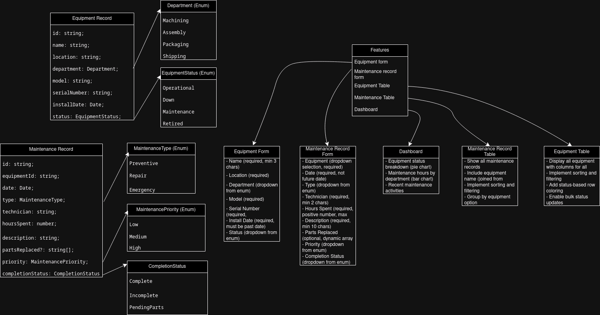

# CMMS
A computerized maintenance management system built with Next.js

## Features
- Equipment form
- Maintenance record form
- Equipment Table
- Maintenance Table
- Dashboard

## System Design

## Documentation
1. Setup Instructions
   - Prerequisites
   - Installation steps
   - How to run the application
   - How to run tests

2. Features Implementation
   - List of completed features
   - Screenshots of key features (optional)
   - API endpoints (if Phase 2 completed)

3. Testing Approach
   - Testing strategy
   - What is tested and why
   - How to run different types of tests

4. Technical Decisions
   - Key libraries used and why
   - Architecture decisions
   - State management approach

5. Known Issues/Limitations
   - Current bugs or limitations
   - Future improvements

## Project Dependencies

### Dependencies
These are the core dependencies required to run the app:
- **next** (15.1.1): The Next.js framework for building server-side rendered React apps.
- **react** (^19.0.0): The core library for building user interfaces.
- **react-dom** (^19.0.0): React package for working with the DOM.
- **zod** (^3.24.1): A TypeScript-first schema declaration and validation library.
- **react-hook-form** (^7.54.1): used for input forms

### DevDependencies
These are development tools and configurations:
- **@eslint/eslintrc** (^3): Shared ESLint configurations.
- **@types/node** (^20): TypeScript type definitions for Node.js.
- **@types/react** (^19): TypeScript type definitions for React.
- **@types/react-dom** (^19): TypeScript type definitions for React DOM.
- **eslint** (^9): JavaScript linting utility.
- **eslint-config-next** (15.1.1): ESLint configuration specific to Next.js.
- **postcss** (^8): CSS processor used by Tailwind CSS.
- **tailwindcss** (^3.4.1): A utility-first CSS framework.
- **typescript** (^5): TypeScript for type-safe development.